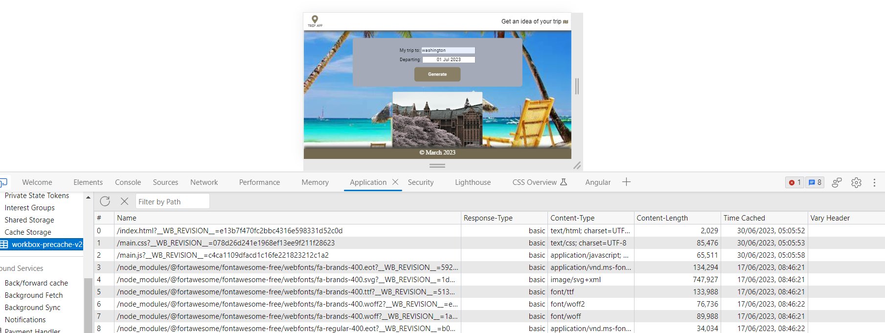

# Project: Travel Planner Web App

## Description
This is a project to Udacity's Front End Web Developer nanodegree where we created a single web app. The app includes a simple form where you enter the location you are traveling to and the date you are leaving. If the travel date is within a week, you will get the weather forecast info for that day from weatherbit API. If the trip is in the future, you will get a predicted forecast from previous historical weather data using visual Crossing API.

### Visuals
Running app


Service worker


Cached Data


It works by getting a desired trip location and date from the user, getting coordinates from Geoname API, then displaying weather and an image of the location(data from Pixabay API) using information obtained from external APIs.


## Project Intro

* Building a web app that allows users to to plan their trips based on predicted weather forecasts for the location they are travelling to.

* The goal of this project is to get practice with:
  - Setting up a server environment
  - Setting up Webpack
  - Sass styles
  - Webpack Loaders and Plugins
  - Targeting the DOM, working with objects
  - Creating layouts and page design
  - Service workers
  - Using APIs and creating requests to external urls
  - Working with Testing units 

* Language and tools for this project:
  - Node & Express: For server side development
  - js: For client side development
  - Webpack: Build tool
  - Service workers: Offline functionality
  - Jest: Testing unit

* Project rubric: 

Check out the specifications [here](https://review.udacity.com/#!/rubrics/3636/view).


## Project Extension

Some extra features were included in this project:

- Allow the user to remove the trip.
- Pull in an image for the country from Pixabay API when the entered location brings up no results (good for obscure localities).
- Add new trip to form a list

## Getting Started

Follow the steps below to get the project running.

Extract the zip and use [NPM](https://www.w3schools.com/whatis/whatis_npm.asp) to install all the dependencies listed in the _package.json_ file:

```
$ cd <project-folder>
$ npm install
```

build the project 
```
$ npm run build-prod
```

Then, start the local server:

```
$ npm start
```

The app will be running in your browser on localhost:8081

Server logs found [here](server-logs.txt)

### Runnning the development mode

Haven completed the steps above, open a second terminal window or tab and start the webpack dev server:

`$ npm run build-dev`

The development version of the app will be running in your browser on localhost:8080  
(the page will automatically update in the browser after any code change)


### Testing Unit

This project has a Testing Unit to check if the main functions are working correctly.
Testing is done with [Jest](https://jestjs.io/). 

To run tests you can use the following NPM command:

`$ npm run test`

The test results will be displayed on the terminal.

Test logs found [here](jest-logs.txt)
